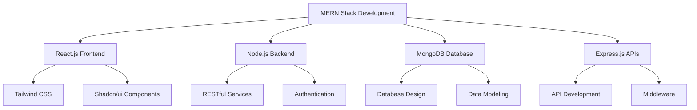

<div align="center">

# 👋 Hey there! I'm a MERN Stack Developer


</div>

---

## 🚀 About Me

<div align="center">
<table>
<tr>
<td width="55%" align="left">

```javascript
const developer = {
    name: "MERN Stack Developer",
    location: "Pakistan 🇵🇰",
    code: ["JavaScript", "HTML", "CSS", "Node.js"],
    technologies: {
        frontEnd: {
            js: ["React.js"],
            css: ["Tailwind CSS", "Shadcn/ui"]
        },
        backEnd: {
            js: ["Node.js", "Express.js"],
            database: ["MongoDB"]
        },
        tools: ["Postman", "Thunder Client", "Git"],
        architecture: ["RESTful APIs", "MVC Pattern"]
    },
    currentFocus: "Building scalable web applications",
    funFact: "I debug with console.log and I'm not ashamed! 🐛"
};
```

</td>
<td width="45%" align="center">


</td>
</tr>
</table>
</div>

---

## 🛠️ Tech Stack & Tools

<div align="center">

### Frontend Technologies


### Backend Technologies  


### Development Tools


</div>

---

## 📊 GitHub Analytics

<div align="center">
  
  
</div>

<div align="center">
  
</div>


## 🟢 Contribution Activity

<div align="center">
  
</div>
<!-- Start -->
<div align="center">
  <h2>
    
  </h2>
  
  <p>
    <em>Every green square tells a story of late nights, breakthrough moments, and pure coding passion</em>
  </p>
  
  
  
  <p>
    <strong>365 days of commitment • Countless lines of code • One developer's dedication</strong>
  </p>
  
  <details>
    <summary>📈 <strong>What this heatmap represents</strong></summary>
    <br>
    <p align="left">
      Each square represents a day in my coding journey:<br><br>
      🟩 <strong>Dark Green:</strong> Heavy coding days - the flow state hits different<br>
      🟢 <strong>Medium Green:</strong> Steady progress - consistency is key<br>
      🌱 <strong>Light Green:</strong> Learning days - absorbing new knowledge<br>
      ⬜ <strong>Gray:</strong> Rest days - even machines need maintenance<br><br>
      <em>"The best way to predict the future is to code it, one commit at a time."</em>
    </p>
  </details>
</div>

---

<div align="center">
  <sub>💡 <strong>Fun fact:</strong> My longest streak was fueled by pure determination and way too much coffee ☕</sub>
</div>
```
<!-- End -->

---

## 🏆 GitHub Trophies

<div align="center">
  
</div>

---

## 💼 What I Do

<table align="center">
<tr>
<td width="50%">

### 🎯 Frontend Development
- ⚛️ **React.js** - Building dynamic UIs
- 🎨 **Tailwind CSS** - Responsive designs
- 🌟 **Shadcn/ui** - Modern components
- 📱 **Mobile-First** - Responsive approach

</td>
<td width="50%">

### ⚙️ Backend Development
- 🟢 **Node.js** - Server-side JavaScript
- 🚀 **Express.js** - RESTful APIs
- 🍃 **MongoDB** - NoSQL database
- 🔐 **Authentication** - Secure applications

</td>
</tr>
</table>

---

## 🌟 Featured Projects

<div align="center">

[](https://github.com/Hasrat270/Movies_App_By_Hasrat)
[](https://github.com/Hasrat270/Mern_Stack_Chat_App_by_hasrat)

</div>

---

## 📈 Contribution Graph

<div align="center">
  
</div>

---

## 🎯 Current Focus



---

## 🏅 Achievements & Certifications

<details>
<summary>📜 Click to expand</summary>

- 🎓 **MERN Stack Development** - Self-taught and project-experienced
- 🏆 **Full-Stack Projects** - Multiple completed applications
- 📚 **Continuous Learning** - Always exploring new technologies
- 🔧 **Problem Solving** - Debug-driven development approach

</details>

---

## 📫 Let's Connect & Collaborate

<div align="center">

### 💡 Open for opportunities and collaborations!

 <em><b>I love connecting with different people</b> so if you want to say <b>hi, I'll be happy to meet you more!</b> 😊</em>

---

**⭐ Star my repositories if you find them interesting!**


</div>

---

<div align="center">
  
</div>
